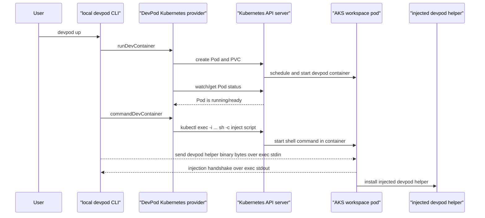
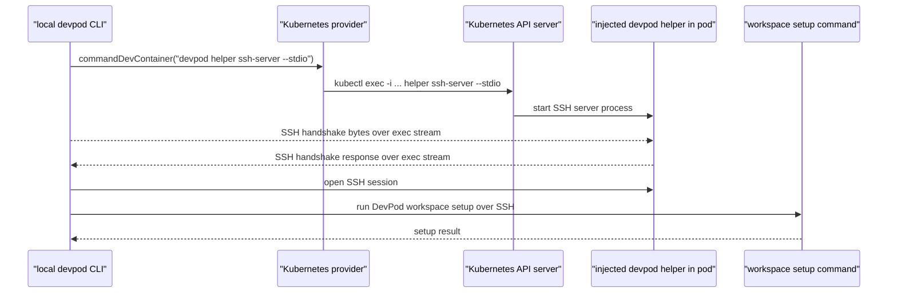
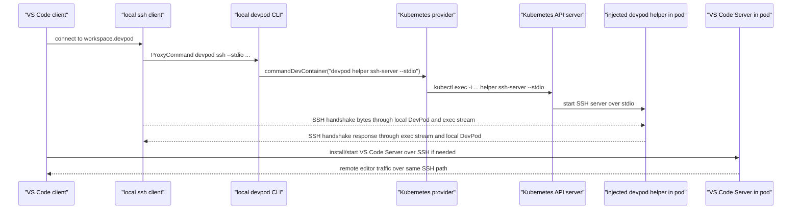

# DevPod SSH Byte Paths on AKS

This note explains the byte paths used when DevPod connects VS Code to a
workspace pod through the Kubernetes provider.

## SSH Semantics, HTTPS/WebSocket Transport

The important point for enterprise review is that DevPod can preserve the SSH
protocol that IDEs already understand without exposing SSH as a network port.

VS Code, Zed, and other IDEs can keep speaking SSH to the local SSH client. The
local SSH client uses `ProxyCommand` to hand those SSH bytes to DevPod. DevPod
then asks the Kubernetes provider to run `kubectl exec`, and `kubectl` carries
the stream to the Kubernetes API server over HTTPS. That HTTPS connection is
upgraded to a long-lived bidirectional stream, usually WebSocket in modern
Kubernetes clients. The SSH bytes transit inside that Kubernetes exec stream.

That gives the workflow two useful properties at the same time:

- IDE pluggability: the editor still uses the broadly supported SSH protocol.
- Enterprise-friendly transport: the underlying network path is Kubernetes API
  HTTPS/WebSocket traffic, not an inbound SSH listener on port 22.

In practical terms, there is normally no pod SSH port to publish, no node SSH
port to route to the workspace, and no workspace-specific firewall hole for SSH.
The network and security control point is Kubernetes API access, especially the
ability to create `pods/exec` streams in the workspace namespace.

## Short Version

DevPod does not normally expose pod port 22. Instead, SSH bytes are carried
through a Kubernetes `exec` stream. The `kubectl exec` transport is an HTTPS
connection to the Kubernetes API server that is upgraded to a bidirectional
stream, with the SSH protocol bytes flowing inside that stream.

```text
VS Code
  -> local ssh client
  -> local devpod CLI
  -> kubectl exec stream over HTTPS/WebSocket
  -> injected devpod helper in the pod
  -> SSH server over stdio
```

`stdio` means standard input and standard output. In this flow, the SSH server
uses stdin/stdout as its network connection instead of listening on a TCP port.

## 1. Workspace Startup And Agent Injection



What is happening:

1. Local DevPod asks the Kubernetes provider to create the workspace pod.
2. The provider talks to the Kubernetes API server using the configured kubeconfig.
3. Once the pod is ready, local DevPod uses the provider command hook.
4. The provider command hook uses `kubectl exec`.
5. DevPod sends the helper binary and install script through that exec stream.

## 2. DevPod Setup SSH Stream



What is happening:

1. Local DevPod opens a fresh Kubernetes exec stream.
2. Inside the pod, the injected helper runs `devpod helper ssh-server --stdio`.
3. Local DevPod creates an SSH client over the exec stream.
4. The SSH handshake proves the stdio SSH server is usable.
5. DevPod runs setup commands over that SSH connection.

## 3. VS Code Remote SSH Stream



What is happening:

1. DevPod writes an SSH config entry for a host such as `workspace.devpod`.
2. That SSH config uses `ProxyCommand`.
3. `ProxyCommand` launches local `devpod ssh --stdio`.
4. Local DevPod opens another Kubernetes exec stream to the pod through
   `kubectl`.
5. The injected helper starts another stdio SSH server process.
6. VS Code Remote SSH installs or starts the VS Code Server over that SSH path.

From the IDE's point of view, this is still SSH. That matters because SSH is the
default remote-development protocol for many editors and tools, so DevPod can
plug into existing IDE behavior instead of requiring a custom editor transport.

From the enterprise network's point of view, this is not an inbound SSH
connection to a workspace. The outer connection is the normal Kubernetes API
path: HTTPS to the API server, upgraded to WebSocket or an older streaming
protocol for `exec`.

## 4. Layer View

```text
VS Code Remote SSH traffic
  inside SSH protocol
    inside local DevPod stdio bridge
      inside Kubernetes exec stdin/stdout/stderr stream
        inside WebSocket or older SPDY upgrade
          inside TLS/HTTPS
            inside TCP/IP
```

Definitions:

- SSH: the remote-login protocol used by VS Code Remote SSH.
- ProxyCommand: an SSH feature that sends SSH bytes through another local command.
- Kubernetes exec: the Kubernetes API operation that runs a process inside a pod.
- WebSocket: the long-lived bidirectional stream commonly used by modern
  Kubernetes exec after the HTTPS connection is upgraded.
- TLS: the encryption layer used by HTTPS and secure WebSockets.
- stdio: standard input/output pipes attached to a process.

## Security Summary

The default concern is not usually an exposed pod port 22, because this flow
does not require publishing SSH on the workspace pod or opening an SSH firewall
path to it. The more important control point is Kubernetes API access.

Users or identities that can create `pods/exec` in the workspace namespace can
run commands inside workspace pods. Users or identities that can create
`pods/portforward` may be able to reach listening ports inside pods.

Useful checks:

```bash
kubectl auth can-i create pods/exec -n devpod-workspaces
kubectl auth can-i create pods/portforward -n devpod-workspaces
kubectl -n devpod-workspaces get svc,ingress
```
